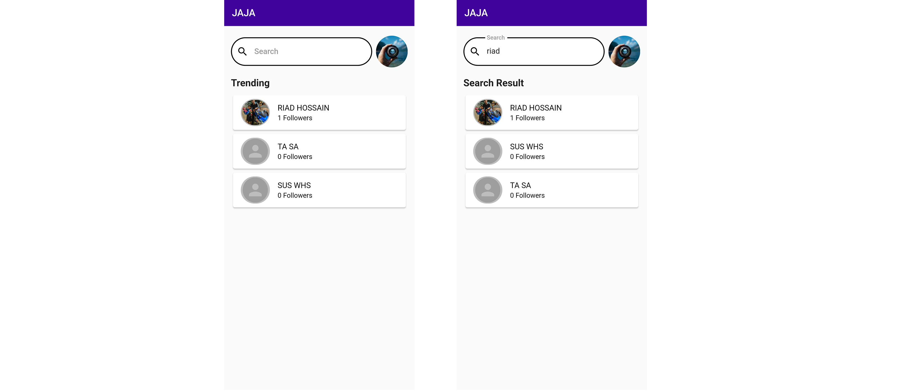
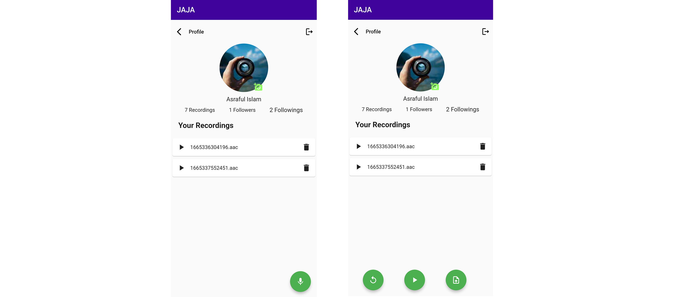
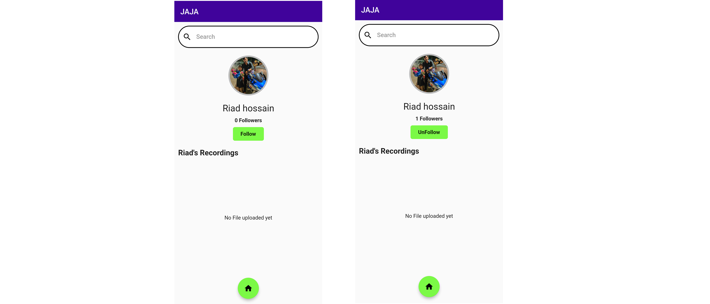

# JAJA

A new Flutter Record Sharing project.

**Features:**

- Save Login Data to local Storage
- Follow Users
- Search Users
- Visit User Profiles
- Share Recordings
- Delete Uploaded Recordings

**Packages we are using:**

- firebase_auth: [link](https://pub.dev/packages/firebase_auth)
- firebase_core: [link](https://pub.dev/packages/firebase_core)
- cloud_firestore: [link](https://pub.dev/packages/cloud_firestore)
- firebase_storage: [link](https://pub.dev/packages/firebase_storage)
- shared_preferences: [link](https://pub.dev/packages/shared_preferences)
- cached_network_image: [link](https://pub.dev/packages/cached_network_image)
- image_picker: [link](https://pub.dev/packages/image_picker)
- flutter_sound_lite: [link](https://pub.dev/packages/flutter_sound_lite)
- permission_handler: [link](https://pub.dev/packages/permission_handler)
- path_provider: [link](https://pub.dev/packages/path_provider)
- audioplayers: [link](https://pub.dev/packages/audioplayers)
- webview: [link](https://pub.dev/packages/webview_flutter)

<!-- This application contains single screen and a special feature of RealTime visualization of Last 7 Days Expences.
User can delete the  Expense any time they want. -->

This is a complete functional application that works on both Android and iOS devices.

# JAJA App Final UI

**Home Screen**

**Profile Screen**
 

**User Screen**
 

 
 

# Change Application Name & Bundle Id
## Package - rename: [link]( https://pub.dev/packages/rename)

- Rename Application Name : run rename --appname "Jaja"  
- Rename Application Bundle ID : run rename --bundleId com.jaja.voiceshare  

# Change App Icon
## Package - flutter_launcher_icons: [link]( https://pub.dev/packages/flutter_launcher_icons)

- step 1 : Replace the logo.png image with your logo. 
- step 2 : Change the logo path in pubspec.yaml file 
- step 3 : Run "flutter pub get" 
- step 4 : Run "flutter pub run flutter_launcher_icons:main"

# Change Splash Screen
## Package - flutter_native_splash: [link]( https://pub.dev/packages/flutter_native_splash)

- step 1 : Replace the logo.png image with your logo. 
- step 2 : Change the logo path in pubspec.yaml file 
- step 3 : Run "flutter pub get" 
- step 4 : Run "flutter pub run flutter_native_splash:create" 

# Update Pods
## Run All Commands

 
cd ios

pod cache clean --all

rm Podfile.lock

rm -rf .symlinks/

cd ..

flutter clean

flutter pub get

cd ios

pod update

pod repo update

pod install --repo-update

pod update

pod install

cd ..

## You must be in your application directory to run those commands